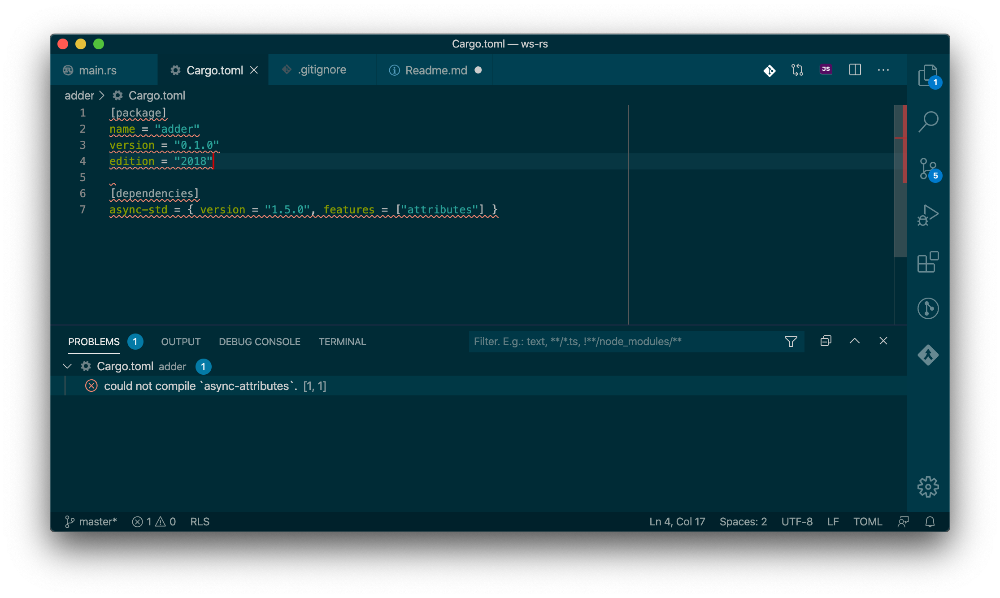

This is repo illustrates the problem with [rls-vscode][]. With this project
setup running `cargo check` produces following output:

```
cargo check
    Checking adder v0.1.0 (/Users/gozala/Projects/ws-rs/adder)
error: cannot find macro `println2` in this scope
  --> adder/src/main.rs:2:5
   |
2  |       println2!("Hello, world!");
   |       ^^^^^^^^ help: a macro with a similar name exists: `println`

error: aborting due to previous error

error: could not compile `adder`.

To learn more, run the command again with --verbose.
```

Plugin however does not display this error, instead it reports error in
`Cargo.toml`.



VSCode settings are included in the `.vscode/settings.json`.

Including additional setup information:

```
rustup show
Default host: x86_64-apple-darwin
rustup home:  /Users/gozala/.rustup

installed toolchains
--------------------

stable-x86_64-apple-darwin
nightly-x86_64-apple-darwin (default)

active toolchain
----------------

nightly-x86_64-apple-darwin (default)
rustc 1.44.0-nightly (f509b26a7 2020-03-18)
```

[rls-vscode]: https://github.com/rust-lang/rls-vscode
